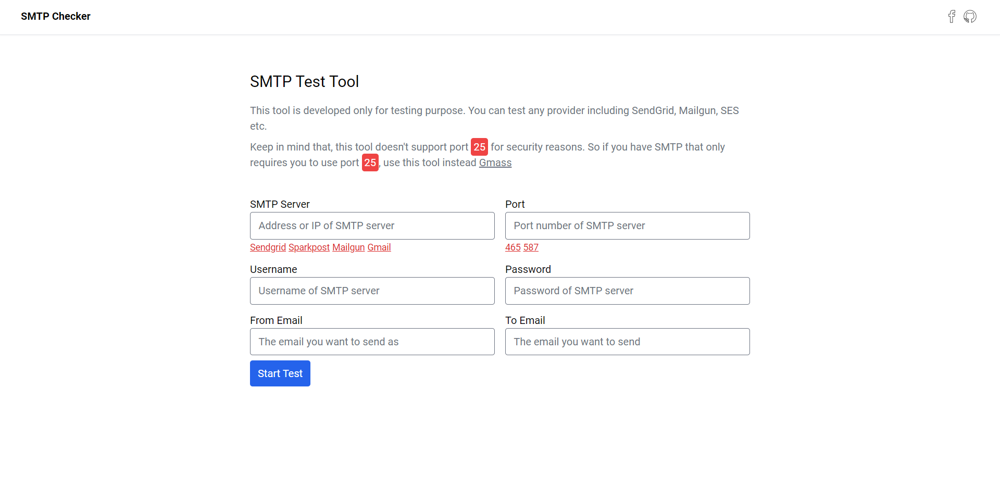

# V2 SMTP Checker with Svelte, Tailwind, NodeJS and Serverless



<br>

## Overview

This project is using NodeJS as backend running in AWS lambda as Netlify functions. It has serverless rate limiting done with redis. You can get redis for free from here, [Upstash](https://upstash.com). In order to use it, click this [link](https://smtp-checker.sites.raiyansarker.com).

## Rate Limiting

As the API is public, in order to protect from potential hacker, there is a rate limiting mechanism. You can only request 6 times in a minute. But if you are deploying it by yourself, you can change the rate limit by changing environment variable,

```
POINTS = 100
DURATION = 60
```

## Stack

These are the things used in the project

- Svelte
- Tailwind
- Netlify Functions
- TypeScript

## Get started with this project

Install the dependencies...

```
npm insall  <- npm
yarn        <- yarn
```

development server

```
npm run dev <- npm
yarn dev    <- yarn
```

## Building and running in production mode

```
npm run build <- npm
yarn build    <- yarn
```
